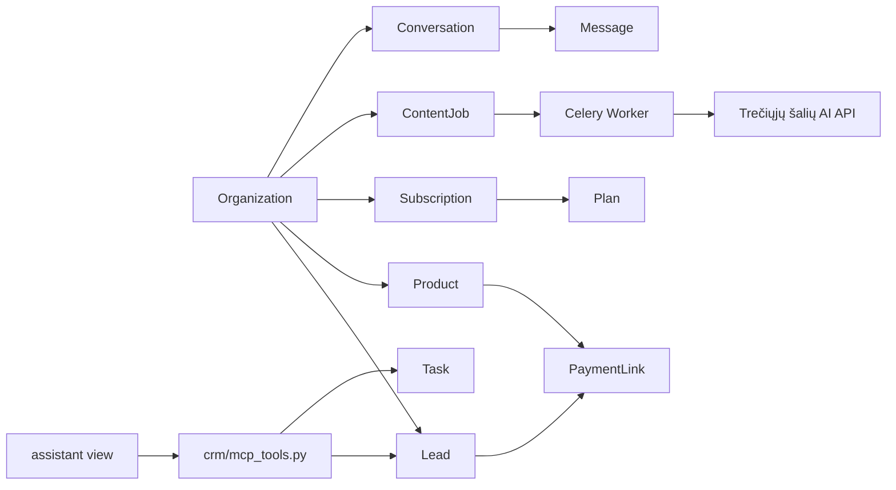

# Bussy'Note MVP: techninė architektūra

## 0. Kontekstas ir sprendimas dėl frontend'o

Esamas `djangonote-crm` pagrindas (Django + DRF + Celery/Redis + HTMX) lieka branduoliu. `skybridge_crm` (React) **nenaudojamas toliau** — jis net nėra prijungtas prie `settings.py`/URL routing šiuo metu, tad tai ne atsisakymas ko nors veikiančio, o tiesiog sprendimas neinvestuoti į jį.

Vietoj to:

- **HTMX** — visiems standartiniams CRUD/list/filter/modal ekranams (jau įrodyta veikianti CRM dalyje: leadai, pipeline, follow-up).
- **Alpine.js** — plonas klientinės būsenos sluoksnis ten, kur reikia grynai UI logikos be serverio round-trip (modalo atidarymas/uždarymas šiuo metu daromas per rankinį `onclick` JS — Alpine tai suvienodintų; tabs/accordion; formos lauko show/hide pagal kitą lauką; AI pokalbio langelio žinučių sąrašas prieš gaunant serverio atsakymą).
- **HTMX + SSE** (`django-eventstream` arba paprasta `StreamingHttpResponse`) — AI asistento pokalbio srautiniam (streaming) atsakymui ir ilgai trunkančių generavimo užduočių progreso rodymui, be atskiro build pipeline'o.

Šis derinys leidžia visą „Bussy'Note" MVP kurti be atskiro frontend build žingsnio (npm/vite/webpack), kas svarbu vienam žmogui/mažai komandai palaikyti.

## 1. Aukšto lygio moduliai (nauji Django app'ai)

| App | Paskirtis | Naujas ar plečia esamą |
|---|---|---|
| `crm` | Leadai, komentarai, užduotys, activity log | Esamas, nekeičiamas |
| `accounts` | `Organization` modelis, narystė, multi-tenant scoping | Naujas (pakeičia `Profile.organization` tekstinį lauką FK) |
| `catalog` | Produktai / paslaugos | Naujas |
| `billing` | Prenumeratos, planai, mokėjimo nuorodos (Stripe) | Naujas |
| `assistant` | AI verslo asistentas (pokalbis + MCP tool-calling) | Naujas, remiasi esamu `crm/mcp_tools.py` |
| `ai_content` | AI marketingo turinio generavimas (tekstas/vaizdas/video) | Naujas |
| `platform_admin` | SaaS savininko dashboard (organizacijos, MRR, limitai) | Naujas |

Kiekvienas app'as — atskiras Django app su savo `models.py`/`views.py`/`templates/<app>/`, tas pats HTMX pattern'as, kuris jau veikia `crm` app'e (partial fragmentai `templates/<app>/partials/`, `HX-Request` header'io tikrinimas view'uose, `HX-Redirect` sėkmės atveju).

## 2. Multi-tenant pagrindas (pirmiausia, nes viskas kitas nuo to priklauso)

```python
# accounts/models.py
class Organization(models.Model):
    name = models.CharField(max_length=150)
    slug = models.SlugField(unique=True)
    created_at = models.DateTimeField(auto_now_add=True)


class Membership(models.Model):
    ROLE_CHOICES = [('owner', 'Owner'), ('member', 'Member')]
    user = models.OneToOneField(User, on_delete=models.CASCADE)  # MVP: 1 user = 1 org
    organization = models.ForeignKey(Organization, on_delete=models.CASCADE, related_name='members')
    role = models.CharField(max_length=20, choices=ROLE_CHOICES, default='owner')
```

MVP supaprastinimas (kaip jau numatyta `docs/technical-plan.md` §11.A): **vienas vartotojas = viena organizacija**, `OneToOneField` vietoj M2M. Multi-user org'ai — vėlesnis etapas.

`Lead`, būsimi `Product`, `Subscription` ir t.t. gauna `organization = models.ForeignKey(Organization, ...)` vietoj/greta `owner`. Migracija: sukurti `Organization` kiekvienam esamam `User`, susieti esamus `Lead.owner` duomenis per `Lead.owner.membership.organization`. Visi view'ai jau filtruoja `owner=request.user` — pereiti prie `request.user.membership.organization` filtro yra tiesmukas pakeitimas, ne perrašymas.

## 3. Katalogas (`catalog`)

```python
class Product(models.Model):
    organization = models.ForeignKey(Organization, on_delete=models.CASCADE, related_name='products')
    name = models.CharField(max_length=150)
    description = models.TextField(blank=True)
    price = models.DecimalField(max_digits=10, decimal_places=2)
    currency = models.CharField(max_length=3, default='EUR')
    active = models.BooleanField(default=True)
    created_at = models.DateTimeField(auto_now_add=True)
```

UI: tiksliai tas pats receptas kaip `crm/views.py` leadų CRUD — sąrašas su HTMX filtru (Etapas 2 pattern), modalas kūrimui/redagavimui (Etapas 4 pattern, `_lead_form_modal.html` → `_product_form_modal.html`). Nulis naujo dizaino sprendimo, tik pakartojamas patikrintas šablonas.

## 4. Mokėjimo nuorodos ir prenumeratos (`billing`)

```python
class Plan(models.Model):
    code = models.CharField(max_length=30, unique=True)  # 'free', 'pro'
    name = models.CharField(max_length=60)
    monthly_price = models.DecimalField(max_digits=8, decimal_places=2)
    stripe_price_id = models.CharField(max_length=100, blank=True)
    ai_content_quota = models.PositiveIntegerField(default=0)  # per mėnesį

class Subscription(models.Model):
    organization = models.OneToOneField(Organization, on_delete=models.CASCADE)
    plan = models.ForeignKey(Plan, on_delete=models.PROTECT)
    stripe_subscription_id = models.CharField(max_length=100, blank=True)
    status = models.CharField(max_length=20, default='active')  # active/past_due/canceled
    current_period_end = models.DateTimeField(null=True, blank=True)

class PaymentLink(models.Model):
    organization = models.ForeignKey(Organization, on_delete=models.CASCADE)
    product = models.ForeignKey(Product, on_delete=models.SET_NULL, null=True, blank=True)
    lead = models.ForeignKey(Lead, on_delete=models.SET_NULL, null=True, blank=True)
    stripe_checkout_session_id = models.CharField(max_length=150)
    url = models.URLField()
    status = models.CharField(max_length=20, default='pending')  # pending/paid/expired
    created_at = models.DateTimeField(auto_now_add=True)
```

- **Mokėjimo nuoroda**: mygtukas prie `Lead`/`Product` → view sukuria Stripe Checkout Session per Stripe API → grąžina URL, kurį galima nusikopijuoti/nusiųsti klientui. HTMX: `hx-post` į `/billing/payment-links/create/`, atsakymas – fragmentas su nuoroda + "Kopijuoti" mygtuku.
- **Webhook**: `POST /billing/stripe/webhook/` (CSRF exempt, Stripe parašo tikrinimas per `stripe.Webhook.construct_event`) — atnaujina `PaymentLink.status`/`Subscription.status` pagal Stripe įvykius. Šis endpoint'as **nenaudoja** sesijos/CSRF apsaugos, nes tai server-to-server webhook — vietoj to tikrinamas Stripe parašas.
- **Feature gating**: paprastas decorator/mixin `@require_plan_feature('ai_video')`, tikrinantis `request.user.membership.organization.subscription.plan`.

## 5. AI verslo asistentas (`assistant`)

Tai vienintelė dalis, kuriai realiai verta naudoti daugiau nei minimalų JS (Alpine + SSE), nes pokalbio UI yra iš prigimties dinaminis.

```python
class Conversation(models.Model):
    organization = models.ForeignKey(Organization, on_delete=models.CASCADE)
    created_by = models.ForeignKey(User, on_delete=models.CASCADE)
    created_at = models.DateTimeField(auto_now_add=True)

class Message(models.Model):
    ROLE_CHOICES = [('user', 'User'), ('assistant', 'Assistant'), ('tool', 'Tool')]
    conversation = models.ForeignKey(Conversation, related_name='messages', on_delete=models.CASCADE)
    role = models.CharField(max_length=20, choices=ROLE_CHOICES)
    content = models.TextField()
    created_at = models.DateTimeField(auto_now_add=True)
```

**Svarbiausias architektūrinis sprendimas**: asistentas NEGAUNA tiesioginės DB prieigos — jis kviečia tuos pačius **tool'us**, kuriuos jau apibrėžia `crm/mcp_tools.py` (`list_leads`, `create_lead`, `add_note`, `list_due_followups`, ...), lygiai kaip numatyta `docs/technical-plan.md` §14 ("MCP sluoksnis neturėtų tiesiogiai apeiti autorizacijos"). Tai reiškia:

1. Vartotojo žinutė → Django view → Claude API (function calling / tool use) su tool sąrašu iš `mcp_tools.py`.
2. Modelis nusprendžia iškviesti tool'ą (pvz. `list_due_followups`) → tool'as vykdomas **su `request.user`/organizacijos kontekstu**, ne su pilna DB prieiga.
3. Tool rezultatas grąžinamas modeliui → modelis suformuluoja atsakymą.
4. Atsakymas streaminamas atgal per SSE į Alpine komponentą, kuris papildo žinučių sąrašą token po tokeno.

Kadangi šis darbas — HTTP užklausos į išorinį LLM API + galimai kelios sekundės — jis turi vykti **ne** sinchroniškai request-response cikle, o arba (a) tiesioginis streaming view su `StreamingHttpResponse` (paprasčiau, veikia MVP apkrovai), arba (b) Celery + polling (jei reikia atsparumo timeout'ams). MVP: (a).

Alpine komponentas (eskizas):
```html
<div x-data="chatWidget()" x-init="init()">
    <div id="messages">
        <template x-for="msg in messages"><div x-text="msg.content"></div></template>
    </div>
    <form @submit.prevent="send()">
        <input x-model="draft" type="text">
    </form>
</div>
```
`send()` atidaro `EventSource`/`fetch` su streaming body į `/assistant/chat/`, papildo `messages` masyvą gaunamais token'ais. Alpine čia pateisinamas, nes tai vienintelė vieta MVP'e su realiu client-side state, kurio HTMX pats savaime patogiai neduoda (inkrementinis teksto papildymas be pilno DOM fragmento pakeitimo kiekvienam token'ui).

## 6. AI marketingo turinio generavimas (`ai_content`)

```python
class ContentJob(models.Model):
    KIND_CHOICES = [('script', 'Scenarijus'), ('headline', 'Antraštė'), ('image', 'Vaizdas'), ('video', 'Video')]
    STATUS_CHOICES = [('pending', 'Laukia'), ('processing', 'Vykdoma'), ('done', 'Atlikta'), ('failed', 'Klaida')]
    organization = models.ForeignKey(Organization, on_delete=models.CASCADE)
    created_by = models.ForeignKey(User, on_delete=models.CASCADE)
    kind = models.CharField(max_length=20, choices=KIND_CHOICES)
    prompt = models.TextField()
    status = models.CharField(max_length=20, choices=STATUS_CHOICES, default='pending')
    result_text = models.TextField(blank=True)
    result_file = models.FileField(upload_to='ai_content/', null=True, blank=True)
    error = models.TextField(blank=True)
    created_at = models.DateTimeField(auto_now_add=True)
```

Šis modulis **privalo** eiti per Celery (jau sukonfigūruotas, `crm_project/celery.py`, žr. esamą `crm.tasks.send_follow_up_reminders` kaip pavyzdį), nes video generavimas per trečiųjų šalių API gali trukti minutes, ne sekundes:

```python
@shared_task(name='ai_content.tasks.run_content_job')
def run_content_job(job_id):
    job = ContentJob.objects.get(pk=job_id)
    job.status = 'processing'; job.save()
    try:
        if job.kind in ('script', 'headline'):
            job.result_text = generate_text(job.prompt)  # Claude API
        elif job.kind == 'image':
            job.result_file = generate_image(job.prompt)  # trečiosios šalies API
        elif job.kind == 'video':
            job.result_file = generate_video(job.prompt)  # trečiosios šalies API
        job.status = 'done'
    except Exception as e:
        job.status = 'failed'; job.error = str(e)
    job.save()
```

UI srautas: vartotojas užpildo formą (modalas, tas pats pattern) → `ContentJob.objects.create(...)` + `run_content_job.delay(job.id)` → grąžinamas fragmentas su "Generuojama..." + `hx-trigger="every 2s"` polling į `/ai-content/jobs/<id>/status/`, kuris grąžina arba tą patį "vykdoma" fragmentą, arba galutinį rezultatą (be papildomo JS — grynas HTMX polling pattern, jau žinomas iš šio projekto: analogiškas principas kaip Etapo 3 kanban perpiešimas, tik su laikmačiu vietoj mygtuko).

## 7. Admin dashboard (`platform_admin`)

Skirtas SaaS savininkui (tau), ne organizacijos vartotojams. MVP: paprasti, `is_superuser`-apsaugoti HTMX puslapiai:
- Organizacijų sąrašas + jų planas/statusas
- Naujausi `ContentJob` (kiek generuota, kiek nesėkmingų — svarbu stebint trečiųjų šalių API kaštus/limitus)
- Bazinė MRR/prenumeratų suvestinė iš `Subscription`

Django admin (`crm/admin.py` jau naudojamas) gali padengti didelę dalį šito be papildomo kodo — verta pradėti tiesiog nuo `admin.site.register()` naujiems modeliams, o dedikuotą `platform_admin` dashboard'ą kurti tik jei Django admin UI taps per siauras.

## 8. Duomenų architektūros diagrama



## 9. Rekomenduojamas etapų planas

1. **Organization/Membership pagrindas** — be to nieko kito daryti neverta, nes visi nauji modeliai priklauso nuo organizacijos scoping.
2. **Catalog** — paprasčiausias naujas modulis, pakartoja jau įrodytą HTMX CRUD receptą; gera „šablono patikra" naujam app'ui.
3. **Billing: Payment Links** (be pilnos prenumeratos logikos) — verslo vertė greičiausiai matoma (galima siųsti mokėjimo nuorodą klientui iš CRM).
4. **Billing: Subscriptions + feature gating** — reikalinga prieš atveriant AI funkcijas plačiau, nes jos turi realius API kaštus.
5. **AI content generation** (tekstas/antraštės pirmiausia, be video) — Celery pattern jau yra, pridedamas tik naujas app + task.
6. **AI content generation: vaizdai, tada video** — daugiausiai integracinio darbo su trečiosios šalies API, didžiausia kaštų rizika, todėl paskutinis.
7. **AI verslo asistentas (chat)** — sudėtingiausias UI (Alpine+SSE) ir priklauso nuo to, kad `mcp_tools.py` sluoksnis jau būtų subrandintas su multi-tenant scoping (žingsnis 1).
8. **Platform admin dashboard** — bet kada lygiagrečiai, žemas prioritetas kol organizacijų nedaug.

## 10. Ko šis planas sąmoningai NEsprendžia (out of scope MVP'ui)

- Multi-user organizacijos (rolės, pakvietimai) — `Membership` modelis paliktas išplečiamas, bet MVP tik 1:1.
- Trečiųjų šalių API raktų šifruotas saugojimas per-organizaciją (jei kiekvienas klientas norės savo Stripe/AI raktų) — MVP naudoja platformos bendrus raktus.
- Realaus laiko bendradarbiavimas (keli vartotojai vienu metu redaguoja tą patį lead'ą) — nereikalinga vieno vartotojo per organizaciją modeliui.
