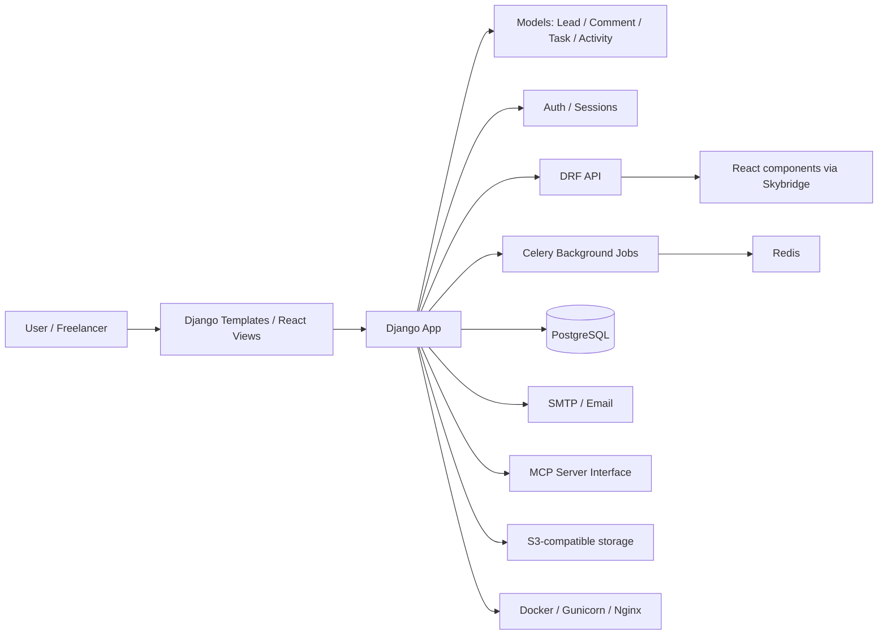
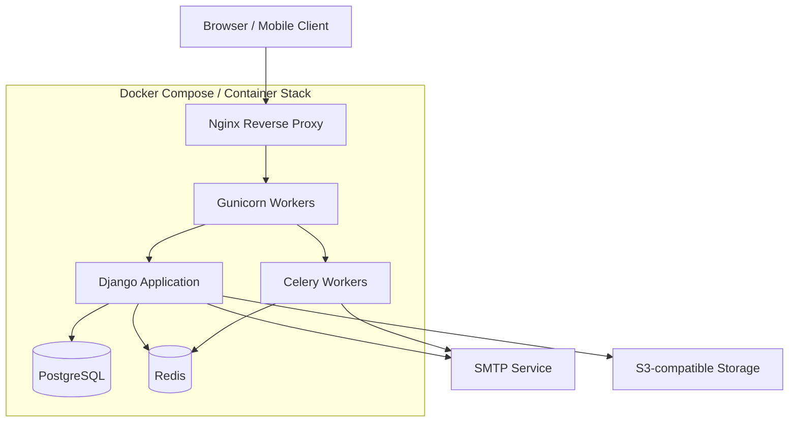

# Techninis planas: freelancerių follow-up CRM

## 1. Pagrindinė kryptis

Projektą rekomenduojama kurti kaip hibridą:

- Django kaip pagrindinis backend'as
- Django REST Framework API verslo logikai ir duomenų prieigai
- Django templates arba server-side renderinti puslapiai MVP pradžiai
- React view'ai per Skybridge ten, kur reikia interaktyvumo
- MCP serverio sąsaja integracijoms ir agentiniams workflow'ams

## 2. Pirmasis etapas: MVP

### Tikslas

Greitai turėti funkcinį CRM, kuris leidžia:

- valdyti lead'us
- sekti follow-up'us
- matyti dashboard'ą
- kurti komentarus / užduotis / istoriją
- siųsti priminimus

### Technologijos

- Python + Django
- SQLite MVP
- Django auth
- Django templates
- Django admin

### Prioritetai

1. Lead modelis ir CRUD
2. Follow-up ir statusų valdymas
3. Dashboard ir pagrindiniai ekranai
4. Paprasta autentifikacija
5. Priminimų siuntimas

## 3. Antras etapas: API ir React view'ai

Kai MVP bus stabilus, galima pereiti prie:

- DRF API endpointų
- React komponentų per Skybridge
- interaktyvių ekranų:
  - Kanban pipeline
  - Dashboard su grafais
  - Inline redagavimas
  - Sudėtingesni filtrai

## 4. Trečias etapas: MCP ir automatizacija

Vėliau galima pridėti:

- MCP serverio sąsają
- agentų ar automatizuotų workflow'ų integracijas
- išorinių įrankių valdymą
- AI pagalbininką komunikacijos ar follow-up procesams

## 5. Duomenų architektūra

Rekomenduojamas pagrindinis modelių rinkinys:

- User
- Lead
- Comment
- Task
- Activity
- Reminder / Notification (vėliau)

## 6. Techninis žingsnių planas

### Etapas A – backend bazė

- Django projektas ir app struktūra
- Auth ir session-based prisijungimas
- Lead CRUD
- Baziniai testai

### Etapas B – verslo logika

- Follow-up datos ir statusų valdymas
- Komentarai ir istorija
- Užduotys ir task statusai
- Priminimai

### Etapas C – UI ir ekranai

- Dashboard
- Leadų sąrašas
- Lead detalės
- Follow-up ekranas
- Pipeline / Kanban
- Nustatymai

### Etapas D – plėtra

- DRF API
- Skybridge + React view'ai
- MCP integration
- PostgreSQL ir produkcinė infrastruktūra

## 7. Praktinis implementation roadmap (pagal savaites)

### Savaitė 1 – stabilus MVP pagrindas

- Užbaigti pagrindinius CRM ekranus: dashboard, leadų sąrašas, lead detalės
- Patikslinti auth ir prisijungimo srautą
- Įdiegti bazinius testus ir užtikrinti, kad pagrindiniai CRUD procesai veikia

### Savaitė 2 – follow-up ir pipeline valdymas

- Pabaigti follow-up ekraną
- Įdiegti pipeline / kanban vaizdą
- Patobulinti statusų logiką ir leadų perėjimą tarp stadijų
- Pridėti paprastą activity log'ą

### Savaitė 3 – komunikacija ir priminimai

- Užbaigti komunikacijos istorijos bloką
- Patobulinti priminimų siuntimą ir veiksmų istoriją
- Pridėti paprastas „quick actions“ iš leadų sąrašo

### Savaitė 4 – nustatymai ir UX patobulinimai

- Įdiegti minimalų nustatymų ekraną
- Patobulinti navigaciją ir bendrą UI konsistenciją
- Paruošti duomenų įvedimo ir redagavimo patirtį

### Savaitė 5 – API ir frontend architektūros paruošimas

- Pradėti DRF API sluoksnį
- Išskirti pagrindines CRUD operacijas į API
- Paruošti endpointus dashboard, leadų sąrašui ir lead detalėms

### Savaitė 6 – Skybridge + React view'ai

- Įjungti Skybridge integraciją React view'ams
- Perkelti kanban ir dashboard dalis į React komponentus
- Palikti Django kaip backend ir duomenų šaltinį

### Savaitė 7 – MCP ir automatizacija

- Suprojektuoti MCP serverio sąsają
- Paruošti integracijas su išoriniais įrankiais ar AI agentais
- Įdiegti pirmuosius automatizuotus workflow'us, pvz. priminimai ar leadų klasifikacija

### Savaitė 8 – gamybinis pasirengimas

- Perjungti duomenų bazę į PostgreSQL
- Pažymėti produkcinius nustatymus, logs, backups
- Patikslinti testus, CI ir deployment planą

## 8. Rekomenduojamas technologijų stack'as

### Backend

- Python 3.12+
- Django
- Django REST Framework
- PostgreSQL
- Celery + Redis priminimams, background job'ams ir automatizacijoms
- django-filter filtrams
- drf-spectacular API dokumentacijai
- django-allauth arba custom auth, jei reikės social login vėliau

### Frontend

- Django templates MVP pradžiai
- React tik specifiniams view'ams
- Skybridge kaip integracinis sluoksnis tarp Django ir React view'ų
- Tailwind CSS arba panašus lengvas UI framework'as

### Infrastruktūra

- Docker
- Gunicorn
- Nginx
- PostgreSQL
- Redis
- S3-compatible storage failams, jei reikės prisegimų
- GitHub Actions CI/CD

## 9. Architecture diagram

## 10. Deployment diagram

## 11. Pagrindiniai sistemos moduliai

### A. Autentifikacija ir vartotojai

Pirmas modulis turi apimti:

- registraciją
- prisijungimą
- slaptažodžio atkūrimą
- vartotojo profilį
- organizacijos / workspace koncepciją

Kadangi tai SaaS, svarbu nuo pradžių turėti multi-tenant logiką.

Paprasčiausias variantas MVP pradžiai:

- vienas vartotojas priklauso vienai organizacijai
- visi lead'ai ir duomenys filtruojami pagal organizaciją

Vėliau galima plėsti į:

- komandas
- roles
- permissions
- kelių vartotojų workspace'us

### B. Leadų valdymas

Šis modulis turėtų tvarkyti visą leadų gyvenimo ciklą:

- leadų kūrimą ir redagavimą
- statusų keitimą
- leadų paiešką ir filtravimą
- leadų detalės peržiūrą
- leadų segmentavimą pagal stadijas
- pastabų, komentarų ir istorijos įrašus

MVP pradžioje pakaks:

- pagrindinio leadų CRUD
- statusų seka
- paprasto pipeline / kanban vaizdo

### C. Follow-up ir komunikacija

Šis modulis apima viską, kas susiję su kontaktu ir priminimais:

- follow-up datas
- priminimų planavimą
- komunikacijos istoriją
- skambučių, el. laiškų ir žinučių žymes
- kontaktų istorijos peržiūrą

MVP pradžioje galima pradėti nuo:

- follow-up datų
- priminimų sąrašo
- komentarų / komunikacijos įrašų

### D. Uždavinių ir automatizacijos moduliai

Šis modulis leidžia automatizuoti rutiną:

- užduočių kūrimą prie leadų
- užduočių statusų valdymą
- priminimų siuntimą
- automatizuotus workflow'us pagal leadų statusą
- galimą integraciją su AI ar MCP serveriu vėliau

MVP pradžioje pakaks:

- užduočių kūrimo ir pažymėjimo
- paprastų automatinių priminimų
- pagrindinės activity logikos

## 12. API planas

Jei naudojamas Django REST Framework, rekomenduojama pradėti nuo šių endpointų:

### Auth

- `POST /api/auth/login/`
- `POST /api/auth/logout/`
- `POST /api/auth/register/`
- `POST /api/auth/password-reset/`

### Leads

- `GET /api/leads/`
- `POST /api/leads/`
- `GET /api/leads/{id}/`
- `PATCH /api/leads/{id}/`
- `DELETE /api/leads/{id}/`

### Notes

- `POST /api/leads/{id}/notes/`
- `GET /api/leads/{id}/notes/`

### Tasks

- `POST /api/leads/{id}/tasks/`
- `PATCH /api/tasks/{id}/`
- `GET /api/tasks/?due=today`

### Pipeline

- `GET /api/pipeline/`
- `PATCH /api/leads/{id}/status/`

### Dashboard

- `GET /api/dashboard/summary/`

## 13. Skybridge panaudojimas

Kadangi planuojama naudoti Skybridge, rekomenduojama jį taikyti tik ten, kur jis duoda didžiausią vertę:

### Kur naudoti Skybridge

- Kanban pipeline
- Dashboard su statistika
- Greitas lead'o redagavimas
- Filtrų panelės
- Inline status change
- Kompleksiniai React komponentai

### Kur nenaudoti Skybridge

- login ekranas
- paprasti CRUD sąrašai
- bazinės formos
- administraciniai puslapiai, jei jie paprasti

Tokiu būdu išvengiama perteklinio frontend sudėtingumo ir išlaikomas paprastesnis MVP architektūrinis pagrindas.

## 14. MCP serverio sąsaja

Jei planuojamas MCP serveris, jis gali būti labai naudingas šiems scenarijams:

- AI asistentas, kuris padeda sekti lead'us
- vidinis agentas, kuris gali:
  - rasti vėluojančius follow-up'us
  - sukurti užduotį
  - pasiūlyti, kam rašyti šiandien
  - sugeneruoti santrauką apie klientą

### MCP funkcijos galėtų būti

- `list_leads`
- `get_lead`
- `create_lead`
- `update_lead`
- `add_note`
- `list_due_followups`
- `mark_task_done`

### Svarbu

- MCP sluoksnis neturėtų tiesiogiai apeiti autorizacijos
- jis turi naudoti tą pačią organizacijos ir vartotojo teisių logiką kaip ir API

## 15. Praktinė rekomendacija dėl MVP

Jei norima greitai paleisti, siūlytina pradėti nuo šio minimalaus starto:

### Pirmas leidimas

- Django backend
- PostgreSQL
- paprasti server-side renderinti puslapiai
- DRF API tik pagrindui
- Skybridge tik kanban ir dashboard
- MCP dar tik kaip planuojamas sluoksnis, ne iškart pilnai

## 16. Rekomendacija

Dabartinis projektas jau gerai tinka pirmam etapui: Django pagrindas, aiški CRM logika ir greitas MVP. Vėliau galima paprastai pereiti prie DRF + Skybridge, neperkraunant viso produkto iš karto.
